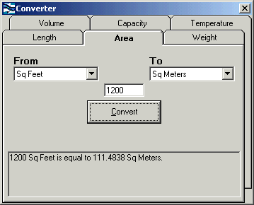



## Unit Converter

### Description

Dug this up; had done it over a year ago. Another unit converter! A few of these around, so here's mine!
 
### More Info
 

             |
---                |---
**Submitted On**   |2002-06-27 16:17:10
**By**             |[Eoin Armstrong](https://github.com/Planet-Source-Code/PSCIndex/blob/master/ByAuthor/eoin-armstrong.md)
**Level**          |Beginner
**User Rating**    |4.7 (14 globes from 3 users)
**Compatibility**  |VB 5\.0, VB 6\.0
**Category**       |[Math/ Dates](https://github.com/Planet-Source-Code/PSCIndex/blob/master/ByCategory/math-dates__1-37.md)
**World**          |[Visual Basic](https://github.com/Planet-Source-Code/PSCIndex/blob/master/ByWorld/visual-basic.md)
**Archive File**   |[Unit\_Conve994166272002\.zip](https://github.com/Planet-Source-Code/eoin-armstrong-unit-converter__1-36313/archive/master.zip)

